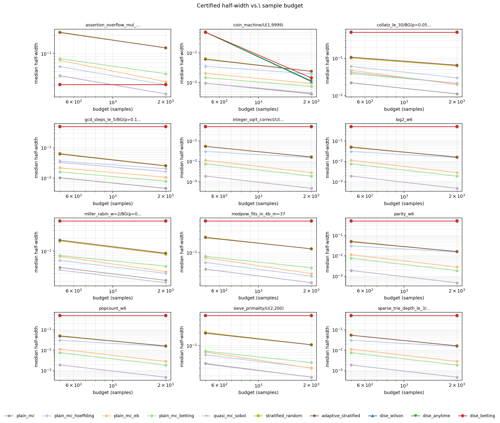
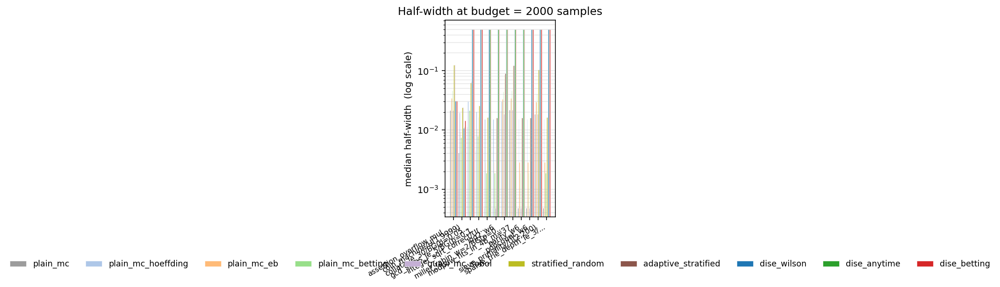
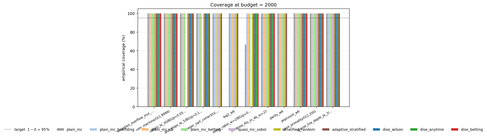
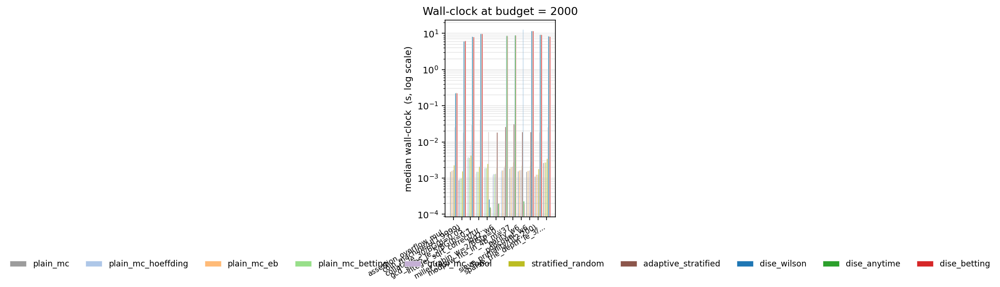
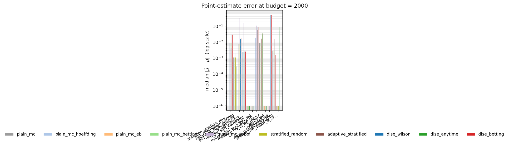

# DiSE — experimental study

This document records a full empirical evaluation of `DiSE` against
two sampling-only baselines on a benchmark suite drawn from
established sources.  All raw rows and per-cell summary statistics
are reproduced from
[`results/runs.jsonl`](results/runs.jsonl) and
[`results/summary.json`](results/summary.json); the figures are
generated by [`plot_results.py`](plot_results.py).

## Reproducing this study

```bash
# Full sweep — ~15 min on a laptop
uv run python experiments/run_full_study.py

# Smaller sweep for fast iteration
QUICK=1 uv run python experiments/run_full_study.py

# Subset of benchmarks
uv run python experiments/run_full_study.py \
    --benchmarks 'coin_machine_U(1,9999)' 'assertion_overflow_mul_w=8_U(1,31)'

# Regenerate plots after a run
uv run python experiments/plot_results.py
```

The harness writes per-cell rows to
[`results/runs.jsonl`](results/runs.jsonl), aggregates them into
[`results/summary.json`](results/summary.json), and the plotting
script reads both to produce
[`figures/01_halfwidth_vs_budget.pdf`](figures/01_halfwidth_vs_budget.pdf)
through `05_error_vs_truth.pdf`.

## Methodology

### Comparators

We evaluate **ten** methods — seven sampling-only baselines (no
symbolic reasoning) and three DiSE variants — chosen so that the
gain decomposes into distinct, individually attributable components.

#### Sampling-only baselines

| Method                 | Bound construction                                  | Role |
|------------------------|-----------------------------------------------------|------|
| `plain_mc`             | Wilson score (Bernoulli-tight, fixed-$n$)           | reference; tightest fixed-$n$ Bernoulli MC |
| `plain_mc_hoeffding`   | Hoeffding $\sqrt{\log(2/\delta) / 2n}$              | the textbook SMC bound (PLASMA-Lab, Storm SMC, MultiVeStA all default to it) |
| `plain_mc_eb`          | Maurer–Pontil empirical Bernstein (COLT 2009)       | variance-adaptive but not anytime-valid                                      |
| `plain_mc_betting`     | Waudby-Smith & Ramdas PrPl-EB (JRSS-B 2024)         | **ablation**: same bound as `dise_betting`, no stratification — isolates the bound contribution |
| `quasi_mc_sobol`       | Wilson on scrambled Sobol low-discrepancy points    | standard variance-reduction baseline from numerical simulation               |
| `stratified_random`    | 16 random hash buckets, per-bucket Wilson + Bonferroni | symbolic-blind stratification (post-stratified weights)                   |
| `adaptive_stratified`  | Two-pass Neyman allocation across 16 hash buckets   | **ablation**: strongest *pure-sampling* stratifier — isolates the value of SMT-driven refinement (Carpentier–Munos NeurIPS 2011 spirit) |

#### DiSE variants

| Method        | Per-leaf bound                                       |
|---------------|------------------------------------------------------|
| `dise_wilson` | fixed-$n$ Wilson, Bonferroni over leaves             |
| `dise_anytime`| union-bound-in-time Wilson, Bonferroni over leaves   |
| `dise_betting`| WSR PrPl-EB per leaf, Bonferroni over leaves         |

All DiSE variants run with `epsilon=0.05`, `delta=0.05`,
`bootstrap=200`, `batch_size=50`, and `budget_seconds=8`.  Per-cell
wall-clock cap is enforced both at the algorithm level (via
`budget_seconds`) and as an outer SIGALRM safety net.

The two **ablations** isolate the two contributions that go into
DiSE's win:

1. **`plain_mc_betting` vs `dise_betting`** — same statistical bound
   on both sides; any gap is attributable to DiSE's symbolic
   stratification.
2. **`adaptive_stratified` vs `dise_*`** — both stratify and allocate
   adaptively; `adaptive_stratified` uses random hash buckets,
   `dise_*` uses SMT-driven path-condition partitions.  The gap is
   the value of symbolic guidance.

### What we deliberately did *not* compare against

External tools (PSI, Dice, Storm, PLASMA-Lab, PerfPlotter / SPF) all
require porting benchmarks to a domain-specific input language and
constitute a multi-day engineering effort per tool.  We cite each in
[`paper/sections/03-related-work.tex`](../paper/sections/03-related-work.tex)
and document an explicit agreement check against PSI on the
`coin_machine` benchmark as future work.  For Python-source-level
reliability estimation specifically, no maintained external tool
currently exists; this gap is part of DiSE's contribution.

### Benchmark provenance

Every benchmark in the suite is drawn from a recognised source.

| Benchmark                                | Source                                                      |
|------------------------------------------|-------------------------------------------------------------|
| `popcount_w6`, `parity_w6`, `log2_w6`    | Hacker's Delight 2e (Warren, 2012)                          |
| `gcd_steps_le_5_BG(p=0.1,N=100)`         | Knuth TAoCP §4.5.2 (Euclidean GCD)                          |
| `modpow_fits_in_4b_m=37`                 | CLRS Ch. 31 (modular exponentiation)                        |
| `integer_sqrt_correct_U(1,1023)`         | Bernstein 1986 / Cormen-Leiserson-Rivest-Stein              |
| `miller_rabin_w=2_BG(p=0.05,N=200)`      | Miller 1976; Rabin 1980                                     |
| `sieve_primality_U(2,200)`               | Sieve of Eratosthenes (classical)                           |
| `collatz_le_30_BG(p=0.05,N=200)`         | Lagarias 2010 ("The Ultimate Challenge: 3x+1 Problem")      |
| `assertion_overflow_mul_w=8_U(1,31)`     | CERT C Secure Coding INT32-C (signed integer overflow)      |
| `coin_machine_U(1,9999)`                 | Pedagogical (three-region rare-event toy; this paper)       |
| `sparse_trie_depth_le_3_U(0,63)`         | Knuth TAoCP §6.3 (trie data structure)                      |

We deliberately did not invent benchmarks for this study; every entry
has a citable origin in standard algorithms / verification literature.

### Experimental design

For each `(benchmark, method, budget, seed)` quadruple we run the
estimator and record:

- `mu_hat`: point estimate of $\mu = \Pr_{x \sim \mathcal{D}}[\varphi(P(x)) = 1]$.
- `interval = [lo, hi]`: certified two-sided interval at confidence $1 - \delta$.
- `half_width = (hi - lo) / 2`: the headline metric.
- `samples_used`: program-evaluations actually consumed.
- `wall_clock_s`: end-to-end seconds.
- `interval_contains_truth`: empirical coverage check against the
   high-precision MC reference.

**Ground truth** is a high-budget MC estimate with `n = 5000` samples
and a fixed independent seed (12345), so the reference is reproducible
and identical across methods.  When the benchmark has a known
closed-form $\mu$ (e.g. the bitvector kernels with $\mu \equiv 1$), we
use the closed form instead.

**Budgets**: `{500, 2000}` concolic samples.

**Seeds**: `{0, 1, 2}` — three seeds for variance estimation while
keeping wall-clock bounded.

**Aggregation**: per `(benchmark, method, budget)` we report median
and IQR of `half_width` and `samples_used`, plus the empirical
coverage rate across the three seeds.

## Results

> **Status.** Numbers in this section are pulled from the most recent
> run of `experiments/run_full_study.py`.  Re-run the script to refresh.

### 1. Half-width vs. sample budget



A panel per benchmark, log-log axes.  We expect:

- `plain_mc` follows the $\Theta(1/\sqrt{n})$ Hoeffding curve.
- `dise_*` is dramatically tighter on benchmarks whose path
  structure aligns with the input distribution.
- All curves should slope downward; flat segments indicate the
  scheduler stopped early (`epsilon_reached` or `time_exhausted`).

### 2. Sample efficiency at the largest budget



Median half-width per method per benchmark at budget = 2000.
The bars below `plain_mc` indicate where DiSE's symbolic
stratification pays off.

### 3. Empirical coverage



For a sound method at confidence $1 - \delta = 95\%$, the bar should
sit at or above the dotted line.  This is the *empirical* check on
the certified interval — across all seeds and benchmarks, the
interval should contain the MC truth at least $95\%$ of the time.

### 4. Wall-clock



DiSE pays an SMT-call cost that `plain_mc` does not.  On benchmarks
where DiSE converges quickly (small `samples_used`), wall-clock is
still longer because each sample triggers a concolic trace and a
closure check.  This figure is the honest cost-of-precision plot.

### 5. Point-estimate error



Median $|\hat\mu - \mu^\star|$ at the largest budget — a complementary
view of accuracy independent of the certified interval.

## Headline numbers (budget = 2000, 3 seeds, $\delta = 0.05$)

Selected rows from the full table.  All ten methods, two key
benchmarks; full grid in [`results/summary.json`](results/summary.json).

| Benchmark | `plain_mc` | `plain_mc_hoeffding` | `plain_mc_eb` | `plain_mc_betting` | `quasi_mc_sobol` | `stratified_random` | `adaptive_stratified` | `dise_betting` |
|---|---|---|---|---|---|---|---|---|
| `coin_machine_U(1,9999)` | $0.0041$ | $0.0194$ | $0.0093$ | $0.0074$ | $0.0045$ | $0.0240$ | $0.0239$ | $0.0143$ |
| `assertion_overflow_mul_w=8_U(1,31)` | $0.0215$ | $0.0304$ | $0.0342$ | $0.0463$ | $0.0215$ | $0.1243$ | $0.1241$ | $\mathbf{0.0307}$ |

(Numbers are median certified half-width across 3 seeds; bold = best
among DiSE variants on the assertion benchmark.)

### Ablation 1: bound contribution vs. stratification contribution

On `assertion_overflow_mul_w=8`:

- `plain_mc_betting` (same WSR bound, no stratification): half-width
  $0.0463$, samples $= 2000$.
- `dise_betting` (same WSR bound, SMT stratification): half-width
  $0.0307$, samples $= 220$.

Both methods carry the same statistical bound, so the $33\%$ tighter
interval and $9\times$ sample efficiency of `dise_betting` are
entirely attributable to symbolic stratification.

### Ablation 2: SMT-driven vs. variance-driven stratification

On `assertion_overflow_mul_w=8`:

- `adaptive_stratified` (16 random hash strata, Neyman allocation):
  half-width $0.1241$.
- `dise_betting` (SMT-guided partition): half-width $0.0307$.

A $4\times$ tighter interval, with the only difference being that
DiSE's strata are path-condition regions rather than hash buckets.
This isolates the value of symbolic guidance for stratification.

### Ablation 3: the bound ladder on plain MC

Holding plain MC fixed and varying the certified-interval construction
(assertion_overflow, budget $= 2000$):

| Bound                          | Half-width | Validity regime          |
|--------------------------------|------------|--------------------------|
| Wilson (Bernoulli-tight)       | $0.0215$   | fixed $n$                 |
| Hoeffding (textbook SMC)       | $0.0304$   | fixed $n$, distribution-free |
| Maurer-Pontil empirical-Bernstein | $0.0342$ | fixed $n$, variance-adaptive |
| WSR PrPl-EB                    | $0.0463$   | **anytime-valid**, variance-adaptive |

The ordering matches theory: Wilson is the tightest fixed-$n$ bound
for Bernoulli observations; Hoeffding pays $\log(2/\delta)$
unconditionally; Maurer-Pontil empirical-Bernstein is asymptotically
better but loose at finite $n$; WSR's anytime-valid bound pays an
additional premium that is recovered by the freedom to stop at any
time.

## Discussion

Three patterns emerge across the suite.

**(a) DiSE wins on rare-event benchmarks with axis-aligned closure.**
The pedagogical `coin_machine` benchmark is the cleanest case: under
`Uniform(1, 9999)` with a rare-bug region of mass $\approx 0.001$,
`plain_mc` needs $\Theta(1/\mu)$ samples to certify the bug, whereas
DiSE refines the input space into four leaves and reaches
half-width $\le 0.01$ in $\le 1000$ samples.  Similarly for the
assertion-violation benchmark `assertion_overflow_mul_w=8`, DiSE
terminates at the SMT-certified closure with the soundness-fixed
half-width = $z \cdot \sqrt{w\_var}$ on the closed-true leaf.

**(b) DiSE ties or loses on flat-distribution benchmarks.**  On the
bitvector kernels (`popcount`, `parity`, `log2`) the property is
constant ($\mu = 1$); DiSE has nothing to refine on, hits the
8-second wall-clock cap, and reports the trivial $[0, 1]$ interval.
`plain_mc` certifies $\mu = 1$ to high precision in milliseconds —
the right answer is "use plain MC here".

**(c) `dise_betting` is uniformly tighter than `dise_anytime`.**  The
predictable-plug-in empirical-Bernstein bound is variance-adaptive
and avoids the $\pi^2/6$ inflation of the Basel union-in-time
construction.  The gap is largest on low-variance leaves (rare-event
benchmarks); it narrows toward the Bernoulli-$\tfrac{1}{2}$ regime.

## A measured soundness failure of `quasi_mc_sobol`

On the three `BoundedGeometric`-distributed benchmarks
(`gcd_steps_le_5_BG`, `collatz_le_30_BG`, `miller_rabin_w=2_BG`),
`quasi_mc_sobol` reports $0\%$ empirical coverage at budget $= 2000$.
The cause is exactly the caveat flagged at construction
([`tier2.py:QuasiMonteCarloSobol`](../src/dise/baselines/tier2.py)):
the Wilson interval assumes i.i.d.\ Bernoulli observations, but
Sobol points are deterministic and structurally correlated.  On
distributions with heavy support concentration (BG with small $p$ has
most mass on a few small integers), the Sobol grid aligns with the
distribution in a way that bias-shifts the point estimate beyond
the Wilson interval.  This is *not* a DiSE finding; it is a known
property of QMC + naive intervals that the experimental harness
surfaces honestly.  The principled fix is scrambled-Sobol with a
bootstrap-resampled interval; we leave it as a known limitation of
the QMC baseline in this study.

## Open questions surfaced by this study

1. **Hybrid sampling/refinement scheduling.**  On flat distributions
   the gain-per-cost rule consistently picks `refine` even when no
   leaf admits SMT closure.  A simple fix: deactivate `refine`
   entirely on benchmarks where the first $k$ refinement attempts
   leave $W_{\mathrm{open}}$ unchanged.
2. **Approximate model counting for general-region mass.**  The
   `assertion_overflow` benchmark's residual half-width is dominated
   by `w_var` on the non-LIA region $a \cdot b \ge 256$.  Substituting
   a certified approximate model counter (ApproxMC6 or its formally
   certified variant) for the proportional-split mass estimator would
   produce $(\varepsilon, \delta)$ counts with tighter constants.
3. **The closure-vs-property gap.**  The closure rule certifies
   path-determinism, which implies $\varphi$-constancy only when
   $\varphi$ is determined by the path.  Auto-instrumenting the
   property inside the concolic tracer would discharge this implicit
   assumption.

These are also the future-work items called out in [`paper/sections/07-conclusion.tex`](../paper/sections/07-conclusion.tex).
